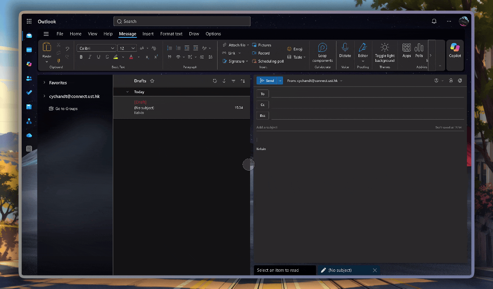
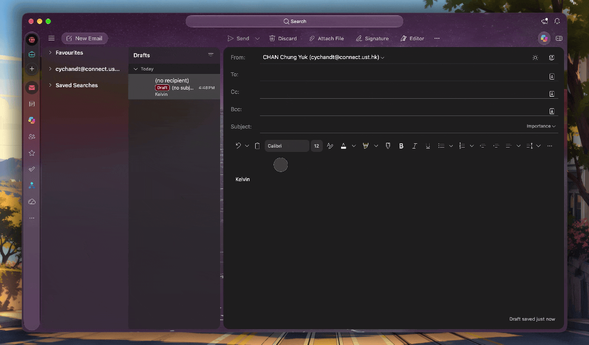

# MailTeX

MailTeX is an Outlook add-in that allows you to write TeX code and insert the rendered equations directly into your email messages.

> [!NOTE] 
> MailTeX, as well as this README, is currently in early development. Limitations exist, especially for Gmail users. Please read below for more details.

## Features

- Write TeX code right next to your email compose window
- Live preview of the rendered equations
- Insert the equations into your email as PNG images

> [!IMPORTANT]
> Currently, MailTeX inserts the rendered equations as PNG images in the email body. While most email clients support this, **Gmail web mail does not seem to be happy about it**. Therefore, if you are sending emails to Gmail users, please think twice before using this add-in.

## Installation

### Sideloading into Outlook
1. Download [the MailTeX add-in manifest file](https://github.com/3underscoreN/MailTex/blob/main/manifest.xml).
2. Visit the official sideloading website at [https://aka.ms/olksideload](https://aka.ms/olksideload). Click `My add-ins`, then select `Add a custom add-in` from the Custom Addins menu. Choose `Add from File...` and upload the downloaded manifest file.
3. Restart Outlook to activate the add-in.

## Usage

### Outlook Web

1. In the Compose menu, click "Apps" on the ribbon, then select "MailTeX" from the list of available add-ins.
2. Type your TeX code in the MailTeX pane.
3. Click the "Insert" button to add the equations to your email as PNG images. Both inline and block equations are supported (we highly suggest using block equations, though).

### New Outlook

1. In the Compose menu. click "..." on the ribbon, then select "MailTeX" from the list.
2. Type your TeX code in the MailTeX pane.
3. Click the "Insert" button to add the equations to your email as PNG images.

